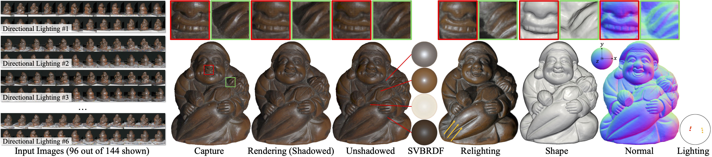

<h2 align="center">Neural Multi-View Self-Calibrated Photometric Stereo without Photometric Stereo Cues</h2>
<h4 align="center">
    <a href="https://xucao-42.github.io/homepage/"><strong>Xu Cao</strong></a>
    ·
    <a href="https://taketomitakafumi.sakura.ne.jp/web/en/"><strong>Takafumi Taketomi</strong></a>
</h3>
<h4 align="center">ICCV 2025 </h3>
<p align="center">
  <br>
    <a href="https://www.arxiv.org/abs/2507.23162">
      
    </a>
    <a href='https://huggingface.co/datasets/cyberagent/mvscps'>
      </a>
    <a href="https://www.youtube.com/watch?v=vivhD-jspmE">
      
    </a>

## Overview
<div align="center">

</div>

MVSCPS jointly recovers geometry, reflectance, and lighting from multi-view one-light-at-a-time (OLAT) images, featuring:
- No light calibration required
- Single-stage, end-to-end optimization; thereby no intermediate photometric stereo step
- Flexible camera-light configurations. In the extreme case, the camera and light source can move independently for each shot.

## Getting Started

### Environment Setup
Installation (Linux, `uv`, CUDA 11.8)
```
chmod +x install_env.sh
./install_env.sh
```
What this installs
- A Python **3.9** virtual environment: `.venv-mvscps`
- If `uv` is not detected, the script automatically installs it.
- **PyTorch 2.5.1**, **torchvision 0.20.1** (CUDA **11.8** wheels)
- Source-built extensions: **tiny-cuda-nn** (Torch bindings) and **nerfacc**
- Training/config stack: **pytorch-lightning 1.9.5**, **hydra-core**, **omegaconf**
- Visualization & scientific libs: **matplotlib**, **pyvista**, **open3d**, **opencv-python**, **imageio[ffmpeg]**, **scipy**, **scikit-image**, **trimesh**, **lpips**, **tensorboard**, **wandb**, **huggingface_hub**, etc.


After successfully setting up the environment, you should see the following output:
```
Python: 3.9.23
[OK] Torch 2.5.1+cu118 | CUDA: True
[OK] VTK 9.2.6 | PyVista 0.37.0
[OK] PyVista import: OK
[OK] Trimesh ray engine: trimesh.ray.ray_pyembree.RayMeshIntersector
[OK] nerfacc 0.3.3 | path: /MVSCPS/.venv-mvscps/lib/python3.9/site-packages/nerfacc
[OK] nerfacc CUDA extension import: nerfacc.cuda
[OK] tinycudann forward OK on cuda: output shape (128, 16)
```

If you are using Docker, including the following lines in your Dockerfile should be sufficient:
```Dockerfile
FROM --platform=linux/amd64 docker.io/nvidia/cuda:11.8.0-cudnn8-devel-ubuntu22.04

# Install dependencies
RUN apt-get update && apt-get -y install python3-pip vim cmake openssh-server build-essential htop nvtop git wget curl unzip zip bash-completion sudo libgl1-mesa-glx xvfb rsync tmux libglib2.0-0 libbz2-dev ffmpeg libsm6 libxext6 && \
    ln -s /usr/bin/python3 /usr/bin/python
```
### Data Preparation

Download and preprocess [DiLiGenT-MV](https://sites.google.com/site/photometricstereodata/mv) dataset (~7GB):

```
. data/prepare_data_diligentmv.sh
```
This script downloads the DiLiGenT-MV dataset in `data/DiLiGenT-MV_origin`, reorganize the file structures in `data/DiLiGenT-MV`, and calculate the scene normalization parameters for training.


Download and preprocess our self-collected dataset (~60GB):

```
. data/prepare_data_mvscps.sh
```
This script downloads our self-collected data from [HuggingFace Dataset](https://huggingface.co/datasets/cyberagent/mvscps) and calculate the scene normalization parameters for training.


### Training
```
. ./launch_diligentmv.sh
```
This script trains MVSCPS on all 5 scenes in DiLiGenT-MV dataset sequentially. 
OLAT images captured from 18 views under 32 lights per view are used for training for each scene. 
The training takes about 15 minutes per scene on a single NVIDIA A100 GPU.
Testing, BRDF map rendering, and relighting are performed after training, and takes about 20~30 minutes per scene.
The trained models and results are saved in `exp/diligentmv`.

Empirical evidences that the training is converging:
- `test/mae_light` drops below 3 degrees within 800 iterations.
- `test/mae_normal` drops below 10 degrees within 3000 iterations.
- `train/inv_s` increases to above 2000 within 10000 iterations.

For training on our self-collected dataset, run the following command:
```
. ./launch_mvscps.sh
```
This script trains MVSCPS on all 6 scenes in our self-collected dataset sequentially.
The training takes about 80 minutes per scene on a single NVIDIA A100 GPU.
The trained models and results are saved in `exp/mvscps`.

### Tips
- **Coordinate system.** We follow the OpenCV convention: x → right, y → down, z → forward.
- **Controlling train/val/test subsets.** We use a plain-text index file to specify which image subsets are used for training/validation/testing. Sample files are provided under `configs/view_light_indices`. You can prepare your own file and set `dataset.train.view_light_index_fname` and `dataset.train.view_light_index_file` in the config file.
- **Using your own data.** Please refer to the folder structure in our [HuggingFace Dataset](https://huggingface.co/datasets/cyberagent/mvscps) and the preprocessing script `data/preprocess_data_mvscps.py`. After your data is prepared, implement your custom image loader in `dataloader/load_fn`, then configure `dataset.img_load_fn`, `dataset.img_ext`, and `dataset.img_dirname` in `configs/conf/mvscps.yaml`. This config file should be fine for your custom data.
- **RAW size mismatch & cropping.** When loading RAW images with [RawPy](https://pypi.org/project/rawpy/), the resulting image can be slightly larger than the size recorded in EXIF. For this reason our loader applies a small crop ([code reference](https://github.com/CyberAgentAILab/MVSCPS/blob/91f847795adcb8ab8400c77583d3663716bd937d/dataloader/load_fn.py#L37)). Note that the required crop region varies by camera vendor (we confirmed differences between Sony and Canon). A practical way to determine the correct crop for your camera is to compare the RAW-rendered image with its in-camera JPEG (e.g., visualize their difference) and adjust the crop until edge discrepancies disappear.
## Acknowledgements
We thank the open-source project [instant-nsr-pl](https://github.com/bennyguo/instant-nsr-pl), distributed under the MIT license. 

```
Copyright (c) 2022 Yuanchen Guo
```

## License
This project is licensed under the [CC BY-NC 4.0](https://creativecommons.org/licenses/by-nc/4.0/) license.
You may use, share, and adapt the material for non-commercial purposes with appropriate credit.

## Citation
```
@inproceedings{mvscps2025cao,
  title = {Neural Multi-View Self-Calibrated Photometric Stereo without Photometric Stereo Cues},
  author = {Cao, Xu and Taketomi, Takafumi},
  year = {2025},
  booktitle = {Proceedings of the IEEE/CVF International Conference on Computer Vision (ICCV)},
}
```